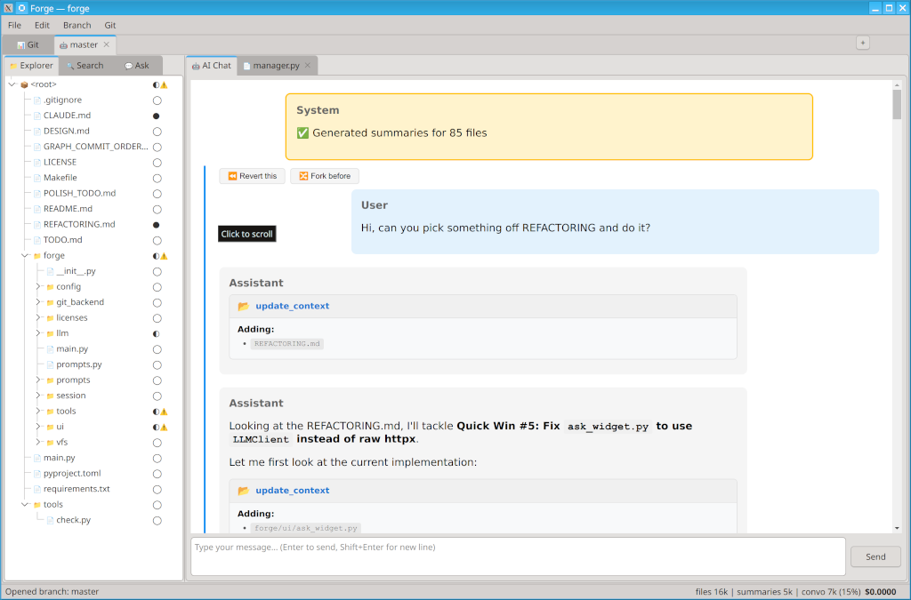

# Forge - AI Agent IDE

**WARNING**: Forge is alpha software. Expect rough edges.



Forge is a Qt-based IDE where AI agents work through git. Every AI session is a branch. Every AI turn is a commit. Check out any commit to see the conversation that created it.

## Philosophy

**Git is the interface.** The AI doesn't touch your filesystem—it reads and writes git objects directly through a virtual filesystem (VFS). Changes accumulate in memory during an AI turn, then commit atomically. This means:

- **Instant rollback**: Don't like what the AI did? `git reset --hard HEAD~1`
- **Clean history**: Each logical change is one commit
- **Parallel work**: Multiple branches open simultaneously, no checkout conflicts
- **Full audit trail**: The conversation is stored in `.forge/session.json` within each branch

**Tools, not commands.** The AI has no shell access. Instead, it has a set of tools that operate on the VFS. Built-in tools handle file editing. Custom tools (in `./tools/`) can do anything—but require explicit approval before first use.

## Features

- **Branch-first workflow**: Each tab is a branch with its own AI session
- **Atomic commits**: AI turn = one commit. Always.
- **Smart context**: AI sees file summaries for the whole repo, full content for active files
- **Tool system**: Secure, auditable capabilities instead of shell commands
- **Session persistence**: Conversations survive across restarts
- **Keyboard-driven**: Ctrl+E quick open, Ctrl+Shift+F global search, Ctrl+S save
- **Cancel & rewind**: Stop the AI mid-turn, or rewind conversation to any point

## Installation

Installation requires Python 3.10+ and libgit2.

1. Install libgit2 (required for pygit2):

```bash
# macOS
brew install libgit2

# Ubuntu/Debian
sudo apt-get install libgit2-dev
```

2. Install Forge. You can do this manually by cloning the repository or use uv or pipx:

```bash
# Manual installation
git clone https://github.com/FeepingCreature/forge
cd forge
python3 -m venv .venv
# Change to `source .venv/bin/activate.fish` for the fish shell
source .venv/bin/activate
pip install -e .

# uv
uv tool install git+https://github.com/FeepingCreature/forge@master

# pipx
pipx install git+https://github.com/FeepingCreature/forge@master
```

3. Set your [OpenRouter](https://openrouter.ai/) API key:

```bash
export OPENROUTER_API_KEY=sk-or-...
# Or configure via Settings (gear icon)
```

## Usage

```bash
# Open Forge in any git repository
cd your-project
forge

# Open specific files
forge src/main.py README.md
```

## How It Works

```
┌─────────────────────────────────────────────────────────────┐
│  User: "Add a cache decorator to the database module"       │
└─────────────────────────────────────────────────────────────┘
                              │
                              ▼
┌─────────────────────────────────────────────────────────────┐
│  AI reads file summaries → identifies relevant files        │
│  AI calls grep_open("database") → loads matching files      │
│  AI calls search_replace() → edits database.py              │
│  AI calls write_file() → creates cache.py                   │
│  AI calls check() → runs format/typecheck/lint              │
└─────────────────────────────────────────────────────────────┘
                              │
                              ▼
┌─────────────────────────────────────────────────────────────┐
│  All changes committed atomically as one git commit         │
│  Session state saved to .forge/session.json                 │
└─────────────────────────────────────────────────────────────┘
```

## Built-in Tools

| Tool | Purpose |
|------|---------|
| `write_file` | Create or overwrite a file |
| `search_replace` | Make targeted edits (with fuzzy matching for near-misses) |
| `delete_file` | Remove a file |
| `rename_file` | Move or rename a file |
| `update_context` | Add/remove files from active context |
| `grep_open` | Search by regex, add matches to context |
| `grep_context` | Peek at matches without loading full files |
| `get_lines` | View lines around a specific line number |
| `undo_edit` | Revert a file to its state before this turn |
| `compact` | Summarize old tool results to save context space |
| `commit` | Create atomic commits mid-turn |
| `set_license` | Add a LICENSE file |
| `check` | Run `make check` (format + typecheck + lint) |
| `run_tests` | Run the project's test suite (auto-discovers pytest, make test, npm test) |
| `scout` | Send files to a smaller model to answer questions or find relevant files |
| `think` | Extended reasoning scratchpad for complex problems |
| `get_skill` | Get documentation for complex tasks (e.g., creating custom tools) |

## Custom Tools

Add Python scripts to `./tools/` for project-specific automation:

```python
# tools/run_tests.py
def get_schema() -> dict:
    return {
        "type": "function", 
        "function": {
            "name": "run_tests",
            "description": "Run the project's test suite",
            "parameters": {"type": "object", "properties": {}}
        }
    }

def execute(vfs, args: dict) -> dict:
    # Materialize VFS to temp directory
    tmpdir = vfs.materialize_to_tempdir()
    # Run tests...
    return {"success": True, "output": "..."}
```

Custom tools require one-time approval before use (shown in UI with source code). This prevents the AI from creating tools to escape its sandbox.

## Keyboard Shortcuts

| Shortcut | Action |
|----------|--------|
| `Ctrl+E` | Quick open file |
| `Ctrl+S` | Save current file |
| `Ctrl+Shift+S` | Save all files |
| `Ctrl+Shift+F` | Global search |
| `Ctrl+Tab` | Next branch tab |
| `Ctrl+Shift+Tab` | Previous branch tab |
| `Ctrl+W` | Close file tab |
| `Ctrl+Shift+W` | Close branch tab |
| `Ctrl+N` | New branch |

## Security Model

Forge's security comes from **capability restriction**, not permission prompts:

1. **No shell access**: The AI cannot run arbitrary commands
2. **VFS sandbox**: All file operations go through git, not the filesystem
3. **Tool approval**: Custom tools require explicit one-time approval
4. **Immutable history**: Every change is a git commit—trivially reversible

The goal is autonomous AI work within safe boundaries, not constant "are you sure?" prompts.

## Development

```bash
# Install with dev dependencies  
pip install -e ".[dev]"

# Run checks
make check      # format + typecheck + lint
make format     # Auto-format with ruff
make typecheck  # Type check with mypy
make lint       # Lint with ruff
```

Forge develops itself. Most features were built by the AI agent running in Forge.

## Architecture

```
forge/
├── vfs/           # Virtual filesystem (git-backed)
│   ├── base.py          # VFS interface
│   ├── git_commit.py    # Read-only view of a commit
│   └── work_in_progress.py  # Writable layer for AI turns
├── git_backend/   # Git operations (pygit2 wrapper)
├── session/       # Session management and prompt building
├── tools/         # Tool system
│   ├── manager.py       # Tool discovery and approval
│   └── builtin/         # Built-in tools
├── llm/           # OpenRouter integration
├── prompts/       # Prompt construction
└── ui/            # Qt interface
    ├── main_window.py
    ├── ai_chat_widget.py
    ├── branch_tab_widget.py
    ├── file_explorer_widget.py
    └── ...
```

## License

GPL-3.0 — see [LICENSE](LICENSE).
