# Forge Code Review

*Review by Claude Sonnet 4, July 2025. Full codebase read in a single pass (~106 files, ~357k tokens).*

---

## Executive Summary

Forge is a **remarkably well-designed** AI-assisted IDE built on a genuinely novel insight: **git branches as first-class workspaces**. The codebase is coherent, the architecture is sound, and the design documents are unusually honest about tradeoffs. This is clearly a project built by using itself — the dogfooding shows in the attention to real workflow friction.

The main areas for improvement are: some god-object classes that have grown organically, a few abstraction boundaries that could be cleaner, and some opportunities to reduce coupling between the UI layer and session management.

---

## What's Excellent

### 1. The Core Insight: VFS + Git = Safety

The VFS abstraction (`base.py` → `git_commit.py` → `work_in_progress.py`) is the best part of the architecture. By making all file operations go through a virtual filesystem backed by git commits:

- The AI **cannot corrupt the working directory**
- Every change is **atomically committed**
- Rollback is **trivial** (it's just git)
- Multiple branches work **simultaneously** without checkout

This is a genuinely better model than "AI edits files on disk" that most AI coding tools use. The `WorkInProgressVFS` pattern of accumulating changes in memory then committing atomically is elegant and correct.

### 2. The Prompt Cache Optimization Strategy

The `PromptManager` is sophisticated in a way that pays real dividends. The append-only stream with deletions model, the file relocation algorithm for cache preservation, the contiguous file block invariant — these show deep understanding of how Anthropic's prompt caching works. The `append_file_content` method with its "relocate all file blocks from earliest target forward" algorithm is particularly clever.

The ephemeral tool results system (`EPHEMERAL_RESULT` side effect) is a smart optimization: tools like `grep_context` return large results that are only useful for one turn, then get replaced with a placeholder.

### 3. Tool Security Model

The philosophy is right: **review once, run forever**. The alternative (permission prompts on every action) trains users to click "accept" mindlessly. The hash-based approval tracking in `.forge/approved_tools.json` is simple and effective.

The decision to exclude arbitrary shell execution and instead provide specific capability tools (`check`, `run_tests`, `commit`) is a genuinely good security boundary. The `ToolContext` v1/v2 API versioning is a clean way to evolve the tool interface.

### 4. The Inline Command System

The dual invocation model (inline XML in prose vs API tool calls) is well-thought-out. Inline commands (`<edit>`, `<commit/>`, `<run_tests/>`) avoid a round-trip to the API, while API tools (`update_context`, `grep_open`, `scout`) need the richer interaction. The `parse_inline_commands` front-to-back parser correctly avoids matching inside code blocks.

### 5. Session Spawn/Wait/Merge

The child session system is genuinely impressive. The `LiveSession` class handles parent/child coordination, yield/resume semantics, and race condition fixes (the `yield_waiting` method's immediate check for already-completed children). The test suite for this (`test_session_spawn.py`) is thorough and catches real edge cases.

### 6. Design Documents

The project has excellent design documentation (`DESIGN.md`, `CLAUDE.md`, `LIVESESSION_REFACTOR.md`, `REFACTORING.md`). Notably:

- `CLAUDE.md` is a concise, opinionated guide that actually works as AI instructions
- `REFACTORING.md` is honest about known problems and includes completed items
- `LIVESESSION_REFACTOR.md` shows the thinking behind a major architectural change

---

## Architecture Concerns

### 1. `LiveSession` Is Still a God Object (~650 lines)

Despite the `LIVESESSION_REFACTOR.md` improvements, `LiveSession` still owns too much:
- The streaming run loop
- Worker thread lifecycle management
- Parent/child session coordination
- Tool execution orchestration
- State machine transitions
- Queued message handling
- VFS change tracking

The thread management alone (`_stream_thread`, `_tool_thread`, `_inline_thread` with their workers) is complex enough to warrant extraction. Consider:

```
LiveSession (state + messages + parent/child)
  └── TurnExecutor (streaming + tool pipeline + inline commands)
       └── uses WorkerPool (thread lifecycle)
```

### 2. `SessionManager` Does Too Much (~550 lines)

This is correctly identified in `REFACTORING.md` but hasn't been addressed. It handles:
- Active file tracking and context management
- Summary generation (including LLM calls and disk caching)
- Prompt construction delegation
- Commit creation
- VFS lifecycle

The summary generation subsystem alone (with its parallel execution, caching, token budgeting) could be a standalone `SummaryService`.

### 3. `AIChatWidget` Mixes View and Controller (~800 lines)

The widget handles both rendering (HTML generation, streaming JS injection) and orchestration (tool approval flow, workdir state checks, summary progress tracking). The `_on_runner_*` signal handlers are doing controller work that should live closer to the session layer.

### 4. Circular Dependency Pattern

The heavy use of `TYPE_CHECKING` guards across the codebase (especially between `session/`, `tools/`, and `vfs/`) suggests the dependency graph has cycles. This isn't a bug, but it makes the code harder to test in isolation and harder to reason about ownership.

For example: `ToolManager` creates a `WorkInProgressVFS`, but `SessionManager` also creates one via `_create_fresh_vfs()`. Who owns the VFS lifecycle?

---

## Specific Issues

### 1. Thread Safety Could Be Stronger

The `VFS.claim_thread()`/`release_thread()` pattern is good, but:
- `GitCommitVFS` doesn't inherit the thread checks (it has no `super().__init__()` call)
- The assertion model means thread bugs are caught at runtime, not prevented by design
- The `InlineCommandWorker` and `ToolExecutionWorker` both need to claim VFS — if one crashes without releasing, the other is stuck

### 2. Error Recovery in `_on_stream_error` Is Risky

```python
def _on_stream_error(self, error_msg: str) -> None:
    # ...
    # Feed error back to conversation
    self.add_message({"role": "user", "content": error_content})
    # Retry
    self._process_llm_request()
```

This auto-retries on **any** LLM error by feeding the error back as a user message. This could create infinite retry loops if the error is persistent (e.g., context too large, model overloaded). There should be a retry counter or a circuit breaker.

### 3. `main.py` Uses `subprocess` for Git Init

The startup flow that initializes a git repo uses `subprocess.run(["git", "init"])` instead of pygit2. This is the only place in the codebase that shells out to git, breaking the "all git through pygit2" invariant.

### 4. Settings Default Model Mismatch

In `settings.py`:
```python
DEFAULT_SETTINGS = {"llm": {"model": "anthropic/claude-3.5-sonnet"}}
```

But in `constants.py`:
```python
DEFAULT_MODEL = "anthropic/claude-sonnet-4-20250514"
```

These should be the same, or `Settings` should reference `DEFAULT_MODEL`.

### 5. HTML Generation Is Fragile

`tool_rendering.py` (1200+ lines) generates HTML via string concatenation with manual `html.escape()` calls. This is the largest single file in the codebase and the most likely source of XSS-like bugs (though in a local Qt WebEngine, not a browser). A template engine would be safer and more maintainable.

### 6. The `path` File

There's a mysterious `path` file at the repo root containing just `forge/\n`. It appears to be an accident (perhaps from a stray `echo` command). Should be deleted.

### 7. Cost Tracker Singleton Pattern

`CostTracker` uses `__new__` for singleton behavior but also inherits from `QObject`. This is fragile — if the QApplication is recreated (e.g., in tests), the singleton persists with a stale parent. A module-level instance (which it also has as `COST_TRACKER`) would be sufficient without the `__new__` trick.

---

## Code Quality Observations

### Positive

- **Type annotations are consistent** — the mypy config is strict and the code follows it
- **The "no fallbacks" philosophy** from `CLAUDE.md` keeps the code honest
- **Test coverage targets the right things** — the prompt manager tests and session spawn tests cover real edge cases, not trivial getters
- **Commit types** (`PREPARE`, `FOLLOW_UP`, `MAJOR`) with smart amending is a clever git workflow optimization

### Needs Attention

- **`runner.py` is a pure re-export shim** that could be a `__init__.py` re-export instead of a separate file
- **`forge/prompts.py`** and **`forge/prompts/__init__.py`** both re-export `SYSTEM_PROMPT` — one is redundant
- **The `SessionRunner = LiveSession` alias** appears in 4 different places. The migration is done; clean up the aliases
- **Some files lack the `-> None` return type** on methods that return nothing (inconsistent with the mypy strict config)

---

## Suggested Priorities

### High Impact, Lower Risk
1. **Extract `SummaryService`** from `SessionManager` — it's self-contained (LLM calls, caching, token budgeting) and would immediately reduce the god-object problem
2. **Add retry limits** to `_on_stream_error` — prevents infinite loops
3. **Delete the `path` file** and the redundant `forge/prompts.py` re-export
4. **Fix the default model mismatch** between `settings.py` and `constants.py`

### High Impact, Higher Risk
5. **Extract `TurnExecutor`** from `LiveSession` — the streaming/tool/inline pipeline is a self-contained state machine
6. **Add `super().__init__()`** to `GitCommitVFS` so it gets thread safety checks

### Long-term
7. **Template-based HTML rendering** to replace string concatenation in `tool_rendering.py`
8. **Dependency injection** to break circular imports between session/tools/vfs
9. **Unified LLM service** to replace the multiple places that create `LLMClient` instances

---

## Module Dependency Graph

```mermaid
graph LR
    subgraph constants["forge/constants"]
        constants_mod[constants]
    end

    subgraph config["forge/config"]
        settings[settings]
    end

    subgraph git_backend["forge/git_backend"]
        commit_types[commit_types]
        repository[repository]
        actions[actions]
    end

    subgraph llm["forge/llm"]
        client[client]
        cost_tracker[cost_tracker]
        request_log[request_log]
    end

    subgraph prompts["forge/prompts"]
        prompt_system[system]
        prompt_manager[manager]
    end

    subgraph vfs["forge/vfs"]
        vfs_base[base]
        vfs_binary[binary]
        vfs_git_commit[git_commit]
        vfs_wip[work_in_progress]
    end

    subgraph session["forge/session"]
        live_session[live_session]
        sess_manager[manager]
        registry[registry]
        startup[startup]
    end

    subgraph tools["forge/tools"]
        tool_context[context]
        tool_invocation[invocation]
        tool_manager[manager]
        side_effects[side_effects]
        subgraph builtin["tools/builtin"]
            edit_tool[edit]
            commit_tool[commit]
            scout_tool[scout]
            get_skill_tool[get_skill]
            session_tool[session]
            grep_tools[grep_*]
            other_tools[other builtins]
        end
    end

    subgraph ui["forge/ui"]
        main_window[main_window]
        ai_chat[ai_chat_widget]
        branch_tab[branch_tab_widget]
        branch_ws[branch_workspace]
        chat_msg[chat_message]
        chat_stream[chat_streaming]
        chat_styles[chat_styles]
        chat_helpers[chat_helpers]
        tool_render[tool_rendering]
        editor[editor_widget]
        file_explorer[file_explorer]
        side_panel[side_panel]
        cmd_palette[command_palette]
        ask_widget[ask_widget]
        settings_dlg[settings_dialog]
        welcome[welcome_widget]
        git_graph_w[git_graph/*]
        other_ui[other ui]
    end

    %% ── Runtime imports (solid) ──

    %% constants ‚Üí nothing (leaf)
    settings --> constants_mod
    repository --> constants_mod
    repository --> commit_types
    actions --> repository
    client --> cost_tracker
    client --> request_log
    prompt_manager --> cost_tracker
    prompt_manager --> prompt_system

    vfs_wip --> commit_types
    vfs_wip --> vfs_base
    vfs_wip --> vfs_git_commit

    sess_manager --> constants_mod
    sess_manager --> commit_types
    sess_manager --> repository
    sess_manager --> client
    sess_manager --> request_log
    sess_manager --> prompt_manager
    sess_manager --> tool_manager

    tool_manager --> constants_mod
    tool_manager --> commit_types
    side_effects -.-> |leaf| side_effects

    commit_tool --> commit_types
    commit_tool --> side_effects
    scout_tool --> settings
    scout_tool --> client
    get_skill_tool --> settings
    get_skill_tool --> client
    grep_tools --> side_effects
    edit_tool --> side_effects
    session_tool --> constants_mod
    session_tool --> side_effects
    other_tools --> side_effects

    main_window --> settings
    main_window --> constants_mod
    main_window --> commit_types
    main_window --> repository
    main_window --> cost_tracker
    main_window --> ai_chat
    main_window --> branch_tab
    main_window --> branch_ws
    main_window --> git_graph_w
    main_window --> other_ui

    ai_chat --> chat_helpers
    ai_chat --> chat_msg
    ai_chat --> chat_stream
    ai_chat --> chat_styles
    ai_chat --> editor
    ai_chat --> tool_render
    chat_msg --> tool_render
    chat_stream --> tool_render
    chat_styles --> tool_render
    branch_tab --> branch_ws
    branch_tab --> editor
    branch_ws --> constants_mod
    file_explorer --> vfs_binary
    ask_widget --> client
    ask_widget --> vfs_base
    settings_dlg --> constants_mod
    settings_dlg --> client
    welcome --> constants_mod
    welcome --> repository
    git_graph_w --> repository
    cmd_palette --> |actions| cmd_palette
    side_panel --> file_explorer

    %% ── TYPE_CHECKING imports (dashed = not runtime) ──

    live_session -.-> sess_manager
    sess_manager -.-> settings
    sess_manager -.-> vfs_wip
    registry -.-> settings
    registry -.-> repository
    registry -.-> live_session
    registry -.-> sess_manager
    startup -.-> settings
    startup -.-> repository
    startup -.-> live_session
    startup -.-> sess_manager
    tool_context -.-> repository
    tool_context -.-> sess_manager
    tool_context -.-> registry
    tool_context -.-> vfs_wip
    tool_invocation -.-> vfs_base
    tool_manager -.-> repository
    ai_chat -.-> live_session

    %% Builtin tools TYPE_CHECKING
    commit_tool -.-> vfs_wip
    edit_tool -.-> vfs_base
    grep_tools -.-> vfs_base
    scout_tool -.-> vfs_base
    other_tools -.-> vfs_base
    other_tools -.-> vfs_wip
    session_tool -.-> tool_context
    get_skill_tool -.-> tool_context

    %% Styling
    classDef leaf fill:#e8f5e9,stroke:#4caf50
    classDef god fill:#fff3e0,stroke:#ff9800
    classDef cycle fill:#fce4ec,stroke:#e91e63

    class constants_mod,commit_types,cost_tracker,request_log,prompt_system,vfs_base,vfs_binary,side_effects leaf
    class sess_manager,live_session,main_window,ai_chat god
    class tool_context,registry cycle
```



### Reading the Graph

| Style | Meaning |
|-------|---------|
| **Solid arrow** `→` | Runtime `import` — real dependency |
| **Dashed arrow** `-.->` | `TYPE_CHECKING` import — type-only, not runtime |
| 🟢 Green nodes | **Leaf modules** — no forge dependencies, safe foundations |
| 🟠 Orange nodes | **God objects** — high fan-in/fan-out, refactoring candidates |
| 🔴 Pink nodes | **Cycle participants** — involved in TYPE_CHECKING cycles |

### Circular Dependency Analysis

There are **no runtime cycles** — the codebase is clean at import time. All cycles are broken via `TYPE_CHECKING` guards. However, the *conceptual* cycles reveal tight coupling:

#### Cycle 1: `session` ↔ `session` (internal)
```
live_session -.-> sess_manager -.-> (nothing back, but...)
registry -.-> live_session AND sess_manager
startup -.-> live_session AND sess_manager
```
The session package has a 4-way internal tangle: `live_session`, `manager`, `registry`, and `startup` all reference each other through type annotations. This makes it hard to understand any one file in isolation.

#### Cycle 2: `tools` ↔ `session` (cross-package)
```
sess_manager → tool_manager        (runtime!)
tool_context -.-> sess_manager     (type-only)
tool_context -.-> registry         (type-only)
```
`SessionManager` creates and owns `ToolManager` at runtime, but `ToolContext` needs references back to `SessionManager` and `SessionRegistry` for tools like `session` and `compact`. This is the most architecturally concerning cycle — it means tools can reach back into session state.

#### Cycle 3: `ui` ↔ `session` (cross-layer)
```
main_window → (creates sessions)
ai_chat -.-> live_session          (type-only)
```
The UI layer references session types, which is expected for a desktop app, but `AIChatWidget` directly handles `LiveSession` events rather than going through an intermediary.

### Leaf Module Health ✅

The good news: the **foundation layer is completely acyclic**:
```
constants ← settings
           ← commit_types ← repository ← actions
cost_tracker ← client
request_log  ← client
vfs_base ← vfs_git_commit ← vfs_wip
prompt_system ← prompt_manager
side_effects ← (all builtin tools)
```

This is a clean dependency tree. The complexity only emerges in the `session` and `tools` packages where orchestration happens.

---

## Summary

Forge is an unusually well-architected project for its stage of development. The core abstractions (VFS, prompt caching, tool security) are genuinely novel and well-executed. The main technical debt is organic growth of god objects, which the team has already identified and partially addressed. The design documents and `CLAUDE.md` instructions show a mature engineering culture focused on making the right tradeoffs.

The project successfully "eats its own dogfood" — it's built using itself, and that shows in the attention to real developer workflow. The git-first approach isn't just a gimmick; it solves real problems around AI safety, collaboration, and reproducibility that other AI coding tools don't address.

**Rating: This is production-quality architecture with prototype-stage polish.** The foundation is strong; the remaining work is extraction and refinement, not rearchitecting.