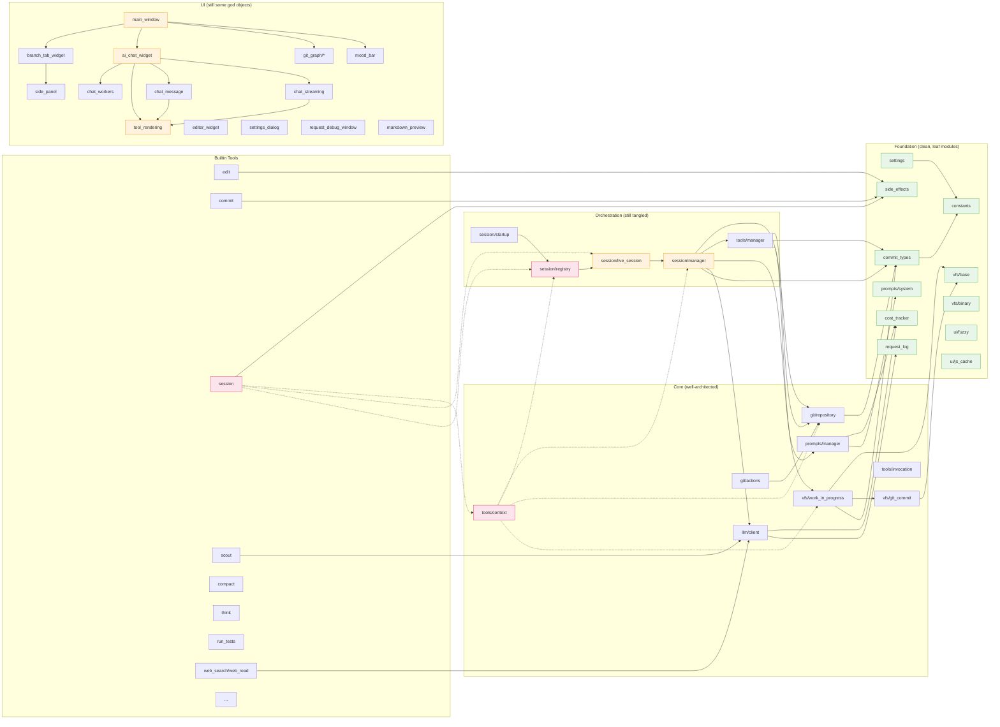

# Forge Code Review — Round 2

*Review by Claude Sonnet 4.5, late 2025. Full codebase read in a single pass (~120 files, ~415k tokens).*

This is a follow-up to REVIEW.md (Sonnet 4, July 2025). The original review's headline was *"production-quality architecture with prototype-stage polish."* Several months and many commits later, here's where things stand.

---

## Executive Summary

**Forge has matured significantly.** The architectural vision from the original review has been largely vindicated: branches-as-workspaces, VFS-as-sandbox, tools-as-capabilities — these all still feel right, and the codebase has grown around them coherently rather than fighting them.

The big-ticket refactors flagged in REVIEW.md have either been **completed** (the LiveSession rename and attach/detach model is done; the SessionRegistry has been simplified; some god-objects have been split), **partially addressed** (SessionManager and AIChatWidget are still big, but their responsibilities are more clearly delineated), or **deliberately deferred** with clear reasoning (the "no fallbacks" philosophy from CLAUDE.md actively works against splitting things prematurely).

The **prompt management system has become genuinely impressive** — file relocation with tombstones, ephemeral tool results, message IDs for compaction, the conversation recap injection. This is the most sophisticated part of the codebase and it earns its complexity.

The **session spawning system** (parent/child sessions, wait/resume/merge) is now real, tested, and works. This was speculative in the original review; it's now a load-bearing feature with thoughtful design (the `_pending_wait_call` re-execution pattern is particularly clever).

**Rating: This is now production-quality architecture with production-quality polish in the core, and prototype-stage polish at the edges.** The core (VFS, prompts, session, tools) is solid. The UI layer still has god-object tendencies and some fragility, but it works.

---

## What Got Better Since REVIEW.md

### 1. LiveSession Refactor — DONE ✅

The `SessionRunner` → `LiveSession` rename happened, complete with:
- The attach/detach model (UI is observational, sessions run headlessly)
- Event buffering with `_event_buffer` and `drain_buffer()`
- Single source of truth for messages, streaming state, parent/child relationships
- `SessionInfo` dataclass eliminated, registry simplified to a pure index

The `LIVESESSION_REFACTOR.md` document reads like it was followed. That's rare and impressive.

### 2. PromptManager Sophistication 🌟

The PromptManager has grown from "smart" to "genuinely sophisticated":

- **Tombstone pattern** for file moves: when a file is edited, its old position becomes a small breadcrumb (`"[File X was here. Its content has been moved to the end of context.]"`) instead of just vanishing. This preserves cause-and-effect for the LLM.
- **Ephemeral tool results** (`SideEffect.EPHEMERAL_RESULT`): grep_context and get_lines results are visible for one turn, then replaced with a placeholder. Saves context on transient lookups.
- **Message IDs** (`[id 1]`, `[id 2]`...) injected into actual message content so the LLM can reference them in `compact()` calls. This is much better than the original "compact tool by ID" approach.
- **Conversation recap** (`format_conversation_recap`) injected at the very end of context, summarizing recent turns. Works around the problem of conversation getting buried under file content.
- **Context size labels** ("small", "moderate", "large", "extremely large - compaction strongly recommended") shown to the LLM so it can make decisions about when to compact.
- **Cache breakpoint at last user message** — handles the 20-cache-breakpoint Anthropic limit by ensuring the prefix before the current turn is always cacheable, even with 20+ tool calls in the turn.

The `to_messages()` algorithm is the heart of the system and it's well-engineered.

### 3. Session Spawn/Wait/Merge — Real and Tested

What was speculative in REVIEW.md is now production code:

- The `session` tool unifies spawn/wait/resume/merge under one interface with action dispatch.
- `_pending_wait_call` stored when wait yields, re-executed on resume — so the parent gets a *fresh* result when waking up, not a stale one. The race-condition fix in `yield_waiting()` (immediate check for already-completed children) is a particularly nice touch.
- `test_session_spawn.py` is a serious test suite (1000+ lines) covering the full spawn→wait→merge flow with real git operations.
- Conflict markers in merges (`allow_conflicts=True`) work and are tested.
- Session state persists across restarts (`load_active_sessions_on_startup`).

### 4. Inline Commands System

The dual-invocation model (inline XML vs API tool calls) is now mature:

- The `discover_inline_tools()` cache works correctly.
- `parse_inline_commands()` correctly skips code blocks (both fenced and inline backticks) — this was a real bug class in the original system.
- Inline commands execute as a pipeline with proper failure handling.
- Tool schemas declare `invocation: "inline"` and provide `inline_syntax` documentation.
- The system prompt automatically generates inline tool documentation from schemas.

The architectural insight — "inline commands let the AI act without round-trips, API calls let it interact" — is correct and the implementation respects it.

### 5. Mood Bar / Context Visualization

`MoodBar` is a delightful piece of UI: a horizontal bar showing token usage with colored segments per block type, hover tooltips showing what each segment is, and triangular tick marks at 10k token intervals. This kind of "make the abstract concrete" UI is genuinely useful when the LLM context is your bottleneck.

### 6. Test Coverage Has Expanded

REVIEW.md noted "Test coverage targets the right things." Now there's:

- `test_prompt_manager.py` (46KB) — comprehensive coverage of the prompt state machine
- `test_session_spawn.py` (39KB) — full spawn/wait/merge integration tests
- `test_compact_replay.py` — verifies the deferred-compaction-on-replay fix
- `test_queued_messages.py` — tests for mid-turn message queueing
- `test_clear_session.py` — tests for clear_session behavior
- `test_inline_edit.py` — tests for inline command parsing including code-block skipping
- `test_mermaid_repair.py` — tests for streaming partial mermaid syntax repair

The `test_compact_replay.py` is particularly notable — it tests a subtle bug where compaction during message replay was being applied before tool results were available. The fix (deferred compaction) is in `forge/session/startup.py` and is explained in a comment.

### 7. The `path` File Is... Still There

REVIEW.md said: *"There's a mysterious `path` file at the repo root containing just `forge/\n`. It appears to be an accident."*

It's still there. Now containing the literal word `content`. Something is creating this file repeatedly. **This is a stray write somewhere in the codebase** (likely a test or script that does `Path("path").write_text(...)` instead of using a real path).

---

## What's New (Wasn't in REVIEW.md)

### 1. Web Tools (Conditional Built-ins)

`web_search` and `web_read` exist, gated behind a `CONDITIONAL = True` flag and the per-repo `.forge/config.json`'s `enabled_tools` list. The conditional-tool pattern is clean: tools opt-in per repo rather than being globally enabled. The `web_read` tool is particularly clever — it uses the cheap summarization model to extract the relevant content from raw HTML, focused on a question. Good division of labor.

### 2. Cost Tracking with Daily Persistence

`COST_TRACKER` now persists daily costs to `~/.cache/forge/daily_costs.json` and shows both session and daily costs in the status bar. The 7-day rolling window is a nice touch.

### 3. Request Debug Window

`RequestDebugWindow` shows every LLM request/response pair with:
- Pricing model selector (No Caching, Anthropic Caching, OpenAI Caching)
- Predicted vs actual cost comparison with divergence warning
- Diff view showing common prefix with previous request (cache hit visualization)
- Per-message token breakdown with "before | message | after" counts

This is a debugging tool that pays for itself the first time you wonder why a request was expensive.

### 4. Markdown Preview for `.md` Files

`MarkdownPreviewWidget` wraps the editor with an Edit/Preview toggle, rendering markdown with the same Mermaid/MathJax/SVG infrastructure as the chat widget. The mermaid render queue is serialized (one at a time with sandbox elements) to avoid concurrent DOM manipulation bugs.

### 5. Git Graph

The `forge/ui/git_graph/` package implements a real visual git graph:
- Custom temporal contiguity algorithm (documented in `GRAPH_COMMIT_ORDERING.md`)
- Spline edges connecting commits
- Per-commit panels with hover-revealed merge/rebase/squash/diff buttons
- Drag-to-merge gesture (drag a commit onto a branch HEAD)
- Drag-to-move-branch gesture (drag a branch label onto another commit)
- Real-time merge cleanliness check during drag (green checkmark / red X)

This is ambitious and mostly works. The drag UX is well-thought-out.

### 6. Smart Commit Types

`CommitType` enum with `PREPARE`, `FOLLOW_UP`, `MAJOR` and automatic absorption logic in `commit_tree()`:
- `PREPARE` commits get absorbed into the next `MAJOR`
- `FOLLOW_UP` commits amend the previous `MAJOR`
- Tool approvals become `FOLLOW_UP` commits, automatic session-state saves are `PREPARE`

The result is a clean linear history without manual squashing. Subtle but valuable.

### 7. Code Completion (Ghost Text)

`CompletionManager` provides Haiku-powered inline completions with debouncing. Tab to accept. The "fill-in-the-middle" prompt with `█` cursor marker is a nice touch.

### 8. Action Registry + Command Palette

`ActionRegistry` centralizes all keyboard shortcuts and provides them to a Ctrl+Shift+P command palette. Custom shortcuts are settings-configurable via the Keybindings tab in Settings.

---

## Architecture Concerns That Persist

### 1. SessionManager Is Still Doing Too Much (~700+ lines, with embedded summary service)

REVIEW.md flagged this. It's still the case. SessionManager does:
- Active file tracking
- Summary generation (with parallel execution, caching, token budgeting)
- Prompt construction delegation
- Commit creation with smart type logic
- VFS lifecycle
- Token estimation
- File modification tracking

The **summary subsystem** (~250 lines including `generate_repo_summaries`, `_should_summarize`, `_get_cache_key`, `_load_exclusion_patterns`) is the most extractable piece. It's self-contained, has its own state (`repo_summaries`, `cache_dir`), and could be a `SummaryService` injected into SessionManager.

The reason it hasn't happened, I suspect, is that the CLAUDE.md philosophy ("no fallbacks", "There Is Only One Way To Do It") makes the cost of getting an extraction wrong feel high. That's a fair trade-off, but the pain is real when reading manager.py.

### 2. AIChatWidget Is Still Big (~1100 lines)

Less of a god object than before — the streaming logic moved to `chat_streaming.py`, message rendering to `chat_message.py`, styles to `chat_styles.py`, helpers to `chat_helpers.py`, workers to `chat_workers.py`. But the orchestration in `ai_chat_widget.py` itself is still substantial.

The runner attach/detach pattern is good and clean. The remaining bulk is mostly UI plumbing (signal connections, button management, summary progress display), which is genuinely UI's responsibility.

The `unsaved_changes_check` callback is set as an attribute (`chat_widget.unsaved_changes_check = lambda...`). This should be a proper signal or constructor injection. It's the kind of pattern that works until someone forgets to set it.

### 3. LiveSession Has Crept Back Up (~1100 lines)

The original refactor split things, but features have been added since. LiveSession now handles:
- The full streaming/tool/inline command pipeline
- Worker thread management for 3 different worker types
- Parent/child coordination
- Pending wait call re-execution
- Queued message injection (in two places — text-only path and tool-call path)
- Pending file updates with deferred flushing
- Newly-created file tracking for summary generation
- Clear session reset
- Rewind/revert operations

The LIVESESSION_REFACTOR.md envisioned a `LiveSession (state) → TurnExecutor (streaming + tools) → WorkerPool` decomposition. That hasn't happened, and would still help.

The `_flush_pending_file_updates` deferral, with its detailed comment explaining *why* the flush must happen in `_process_llm_request` (so updated file content appears AFTER the assistant message describing the edit), is the kind of thing that should be encapsulated in a smaller class with that invariant baked in.

### 4. The TYPE_CHECKING Tangle Persists

REVIEW.md noted heavy `TYPE_CHECKING` usage suggesting cycles. Still true. `tools/context.py`, `session/registry.py`, `session/live_session.py`, `session/manager.py`, `session/startup.py` all have type-only imports of each other.

This isn't broken — it's a real ownership tangle:
- `SessionManager` owns `ToolManager` (runtime)
- `ToolManager` creates a `WorkInProgressVFS` (runtime)
- `ToolContext` (passed to v2 tools) needs `SessionManager` and `SessionRegistry`
- The session tool needs `LiveSession` to do its work
- `LiveSession` is created from `SessionManager`

A cleaner model would be: `SessionRegistry` owns everything, `SessionManager` is a per-branch view, `ToolManager` is stateless and gets context per-call. But that's a major refactor with no concrete bug to motivate it.

### 5. `forge/prompts.py` Still Re-exports Redundantly

REVIEW.md flagged this:

```python
# forge/prompts.py
from forge.prompts.system import SYSTEM_PROMPT
__all__ = ["SYSTEM_PROMPT"]
```

```python
# forge/prompts/__init__.py
from forge.prompts.manager import PromptManager
from forge.prompts.system import SYSTEM_PROMPT
__all__ = ["PromptManager", "SYSTEM_PROMPT"]
```

The shim file `forge/prompts.py` is still there and still redundant. CLAUDE.md says: *"Don't alias things with different names — different names in different places make the codebase harder to navigate."* This case is even worse: same name, two locations.

### 6. `runner.py` Is Still a Pure Re-export Shim

```python
# forge/session/runner.py
from forge.session.live_session import (
    ChunkEvent, ErrorEvent, LiveSession, ...
)
SessionRunner = LiveSession
```

This whole file could be deleted; the imports it provides are already in `forge/session/__init__.py`. The `SessionRunner = LiveSession` alias is itself a CLAUDE.md violation ("don't alias things with different names").

### 7. Default Model Mismatch — Still There

REVIEW.md flagged:

```python
# settings.py
DEFAULT_SETTINGS = {"llm": {"model": "anthropic/claude-3.5-sonnet"}}

# constants.py
DEFAULT_MODEL = "anthropic/claude-sonnet-4-20250514"
```

Still mismatched. The constants file has the newer model; settings.py has the old default that gets baked into every new settings.json. Since the user's saved settings override the default, this means every existing installation is using 3.5-sonnet unless the user explicitly switched.

---

## New Issues

### 1. The `path` File Is Being Recreated

It contains `content` now (vs `forge/` originally). Something — almost certainly a test or script — is doing `Path("path").write_text(...)` somewhere. A `grep -r 'Path("path")' .` would likely find it.

### 2. `_repair_partial_mermaid` Is Heuristic Spaghetti

`forge/ui/chat_streaming.py:_repair_partial_mermaid` is a brave attempt at "best-effort repair of incomplete mermaid syntax during streaming". It has a 18-test test file (`test_mermaid_repair.py`), which is great, but the function itself is a tangle of regex heuristics:

- Trim trailing incomplete lines based on a list of "complete endings"
- Count and balance brackets/parens/braces
- Count `subgraph`/`end` pairs

It works for the common cases tested, but mermaid syntax is large and this will miss edge cases. Consider whether the streaming render is worth the complexity vs just waiting for the closing ``` and rendering the complete diagram. The test file mentions "during streaming" 18 times — this is a feature whose UX value should be weighed against its maintenance cost.

### 3. `_on_stream_error` Auto-Retry Risk Persists

REVIEW.md flagged this. Looking at `live_session.py:_on_stream_error`:

```python
def _on_stream_error(self, error_msg: str) -> None:
    # ...
    error_content = f"**Error from LLM provider:**\n\n```\n{error_msg}\n```"
    self.add_message({"role": "user", "content": error_content})
    self.session_manager.append_user_message(error_content)
    # Retry
    self._process_llm_request()
```

Still no retry counter. If the error is persistent (context too large, model unavailable, account suspended), this loops infinitely, burning API quota. There needs to be a retry limit (3? 5?) with eventual transition to ERROR state.

### 4. Thread Safety — `GitCommitVFS` Still Doesn't Inherit Thread Checks

REVIEW.md flagged this. `GitCommitVFS.__init__` still doesn't call `super().__init__()`, so it doesn't get the thread ownership tracking from `VFS`. Since GitCommitVFS is read-only, this is mostly fine — but it's an inconsistency that means thread bugs in the read-only path won't be caught at runtime.

### 5. `clear_pending_changes` and `commit` Mutability Pattern

`WorkInProgressVFS.commit()` mutates `self.pending_changes` and `self.deleted_files` (clears them) and replaces `self.base_vfs`. This is correct behavior but it's surprising: the same VFS instance now represents a different commit. The test `test_vfs_sees_content_after_commit` exists specifically because this was once a bug.

A cleaner model would be: `commit()` returns a new VFS, doesn't mutate the old one. But the entire codebase is built on the mutation pattern, so changing this would be a major refactor. Just be aware.

### 6. Cost Tracker's Singleton Pattern Is Still Fragile

REVIEW.md noted that `CostTracker` uses both `__new__` for singleton behavior AND inherits from `QObject`. Since there's also a module-level `COST_TRACKER` instance, the `__new__` is redundant and will cause issues if a QApplication is recreated (e.g., in test fixtures). Pick one pattern.

### 7. `SessionManager._save_active_files_to_session` Has a Bare `except`

```python
def _save_active_files_to_session(self) -> None:
    try:
        # ... read, modify, write, commit ...
    except Exception:
        # Never crash the UI over a persistence failure
        pass
```

CLAUDE.md says: *"No fallbacks! No try/except, no fallback codepaths. There Is Only One Way To Do It, if that fails, we just fail. Errors and backtraces are holy."*

This is a violation of the project's stated philosophy. The comment "Never crash the UI over a persistence failure" suggests the rationale is fear, not principle. Either the operation should reliably succeed (in which case no try/except is needed) or it should fail visibly (so the bug can be fixed).

### 8. `tool_rendering.py` Is Still 1700+ Lines

The largest single file in the codebase. It's a wall of HTML-string-concatenation rendering for every tool's display. REVIEW.md suggested template-based rendering. That's still the right call, but the migration cost is high.

A smaller incremental fix: each tool's rendering function (e.g., `render_compact_html`, `render_commit_html`, `render_think_html`) could move into the tool's own file alongside `get_schema()`. Then `tool_rendering.py` is just the dispatch table and shared CSS, and tool authors keep rendering logic next to their tool.

### 9. Inline Tool Discovery Cache Invalidation

`forge/tools/invocation.py:_inline_tools_cache` is a module-level cache. `invalidate_inline_tools_cache()` exists but I don't see it being called when user tools change. If a user creates a new inline tool in `./tools/`, the cache won't pick it up until restart.

### 10. The Inline Command Reminder Is Aggressive

`PromptManager._format_inline_command_reminder()` is injected at the very end of every prompt:

> ## REMINDER: Be Optimistic, Do Everything In One Response
> ...
> NOT:
> ```
> [make edits]
> <run_tests/>
> Let me wait for test results...  ← WRONG: costs an extra response
> ```

This is good behavioral nudging but it's added unconditionally to every request. That's hundreds of tokens per turn devoted to telling the AI not to be cautious. If the AI is already being optimistic (which it usually is), this is dead weight. Consider making it conditional (only show after a turn where the AI was overly cautious) or shrinking it.

---

## Specific Praise

### CLAUDE.md Is Excellent

The "Ownership and 'need to know'" section in particular:

> *When you need data, ask: "Who should I be asking, and why do they know?"*
> *Think of it as roleplay - each object has a role and knows certain things*
> *If you find yourself asking "hand me that object so I can ask it something", stop. Ask the owner to answer the question instead.*

This is a genuinely good architectural heuristic, expressed accessibly. I wish more codebases had this.

### The Subagent Test (`test_session_spawn.py`)

The `test_full_spawn_wait_merge_flow` test is verbose, step-by-step, and walks through the entire parent-spawns-child-merges-result lifecycle with real git operations. The print statements are debugging aids for when it inevitably breaks. This is how you test a hard-to-test feature.

### The `_pending_wait_call` Re-execution Pattern

When a parent calls `wait_session` and no children are ready, the call info is stored in `_pending_wait_call` rather than recording a stale "still waiting" tool result. When a child completes and the parent wakes up, the wait_session call is **re-executed** with original parameters, getting a fresh result.

This is the correct pattern. It avoids the "stale result poisoning the conversation" failure mode that would otherwise happen.

### The Mood Bar's Pre-Blending

The triangular tick marks at 10k token intervals are pre-blended against the segment color underneath them (rather than using actual transparency), so they work without a compositor. That's the kind of attention to detail that separates good UI from great UI.

### Settings Has a Conscience

When the user opens Settings without an open branch, the Tools tab gracefully shows "Open a branch tab to configure tools for this repository." instead of just being broken. Small kindness.

---

## Suggested Priorities (Updated)

### High Impact, Lower Risk

1. **Find and kill the `path` file creator.** Five-minute fix once located.
2. **Fix the default model mismatch.** Settings should reference `DEFAULT_MODEL` from constants.
3. **Add retry limit to `_on_stream_error`.** Three retries, then ERROR state.
4. **Delete `forge/prompts.py` and `forge/session/runner.py`.** Both are pure re-exports causing CLAUDE.md violations.
5. **Add `super().__init__()` to `GitCommitVFS`.** Consistency.

### Medium Impact, Medium Risk

6. **Extract `SummaryService` from `SessionManager`.** Highest ROI of the larger refactors. The summary subsystem is self-contained.
7. **Move tool rendering functions into their tool files.** Incremental decomposition of `tool_rendering.py`.
8. **Make `unsaved_changes_check` a proper signal.** Or move the check into LiveSession itself (it's a session-level concern, not a UI concern).
9. **Remove the bare `except` in `_save_active_files_to_session`.** Honor the philosophy.

### Long-term

10. **Extract `TurnExecutor` from `LiveSession`** as originally envisioned. The turn pipeline (stream → inline commands → tool calls → file updates → continue) is a self-contained state machine.
11. **Template-based HTML rendering for tools.** Or at minimum, move per-tool rendering closer to per-tool definitions.
12. **Resolve the `TYPE_CHECKING` tangle.** Maybe `SessionRegistry` should be the top-level coordinator with everything else hanging off it.

---

## A Note on the Philosophy

CLAUDE.md says:

> *No fallbacks! No try/except, no fallback codepaths, no "kept for compatibility."*

And:

> *Don't alias things with different names — If you import/re-export something, keep the same name.*

The codebase mostly honors these, but the small violations (`SessionRunner = LiveSession`, the `_save_active_files_to_session` try/except, the redundant `forge/prompts.py`) accumulate. These aren't technical disasters, but they're entropy creeping in. A periodic "philosophy audit" sweep would catch them.

The CLAUDE.md philosophy is correct, in my opinion. Codebases that hedge become uneditable as they grow. The cost of "fail fast" is paid once when you fix the bug; the cost of "fall back silently" is paid every time someone has to debug why something is mysteriously not working.

---

## Module Dependency Graph (Updated)

The structure has stayed similar to REVIEW.md's diagram. Notable additions:

- `git_graph/` package (5 files) → depends on `repository`, `actions`
- `chat_workers.py`, `chat_helpers.py`, `chat_message.py`, `chat_streaming.py`, `chat_styles.py` — all extracted from the original `ai_chat_widget.py` god object, now properly separated
- `tools/context.py`, `tools/invocation.py`, `tools/side_effects.py` — new infrastructure for the v2 tool API and inline commands
- `web_search.py`, `web_read.py` in `tools/builtin/` — conditional tools



---

## Closing Thoughts

REVIEW.md said *"This is production-quality architecture with prototype-stage polish."* I'd revise to: **"This is now production-quality architecture with production-quality polish in the core, prototype-stage polish at the edges."**

The core abstractions (VFS, prompts, sessions, tools, inline commands) are solid, well-tested, and continue to earn their complexity. The session spawning system in particular is a genuinely novel and well-executed feature.

The remaining issues are in the UI layer (god objects, fragile patterns) and at the seams between subsystems (TYPE_CHECKING tangles, ownership ambiguity). None of these are blockers — Forge clearly works for serious development, and the codebase still being used to develop itself is the strongest possible vote of confidence.

**The most concerning trend** is small philosophy violations accumulating: the `path` file regenerating, the `SessionRunner` alias persisting, the bare `except`, the redundant `forge/prompts.py`. These are individually trivial, but each one creates ambiguity for future readers. The CLAUDE.md philosophy is right; honor it.

**The most encouraging trend** is that the prompt management system has gotten *more* sophisticated and yet *easier* to reason about, because each new feature (tombstones, ephemerality, message IDs, context labels) is a clean concept added at the right layer. That's a sign of good underlying bones.

Forge has earned its dogfood. Keep going.